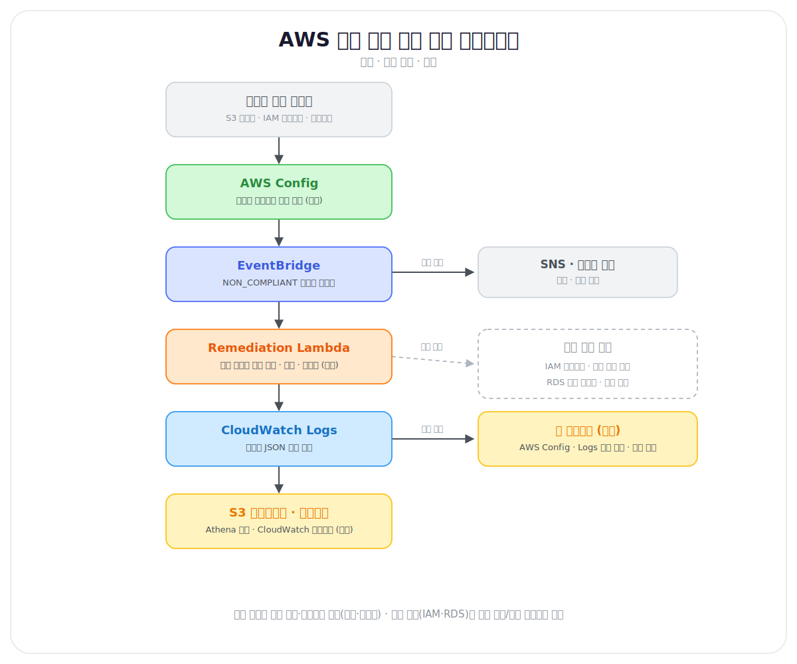

# 아키텍처 (ARCHITECTURE.md)

이 문서는 AWS 보안 설정 자동 조치 파이프라인의 전체 구조와 데이터 흐름을 설명한다.

---

## 1. 설계 철학

이 프로젝트는 세 계층으로 구성된다.

1. **탐지(Detect)** — 무엇이 잘못 설정되었는가를 상시 감지한다.
2. **조치(Remediate)** — 감지 즉시 자동으로 안전한 상태로 되돌린다.
3. **운영(Operate)** — 조치를 매뉴얼화하고, 이력을 남기고, 예외를 관리한다.

핵심 차별점은 **이벤트 기반**이라는 것이다. 배치 스캔(예: Prowler를
주기 실행)이 아니라, 설정이 바뀌는 "순간"을 이벤트로 잡아 **상시 대응**한다.

---

## 2. 전체 아키텍처

---

## 3. 구성요소별 역할

### 의도적 취약 리소스
평가·조치의 대상이 되는 테스트 베드. **코드(Terraform)로** 만들어
재현 가능하게 한다. 스크린샷이 아니라 코드로 취약점을 만든다는 점이
"취약점을 진짜로 이해하고 있다"는 증거가 된다.

### AWS Config
리소스 구성 변경을 상시 기록하고, 관리형 규칙으로 위반 여부를 평가한다.
이 파이프라인의 "탐지 엔진" 역할.

### EventBridge
Config의 컴플라이언스 변경 이벤트를 받아 조치 Lambda로 라우팅한다.
이 연결 덕분에 "탐지 → 조치"가 사람 개입 없이 자동으로 이어진다.

### Remediation Lambda
실제 조치를 수행하는 자동화 스크립트(Python). 다음 원칙을 지킨다.
- **멱등적**: 중복 실행돼도 안전
- **비파괴적**: 노출 차단만 수행, 삭제 없음
- **관측 가능**: 조치 결과를 구조화 로그로 기록

### CloudWatch Logs → S3 로그 레이크 (Athena)
조치 이력의 저장·분석 계층. 각 조치 Lambda 는 CloudWatch Logs 에 정규화된
JSON 한 줄 로그를 남기고(탐지·조치 시나리오들), 로그 레이크에서 이 로그와 감사 로그
(CloudTrail·VPC Flow Logs)를 하나의 S3 버킷(로그 레이크)에 모아 Athena 로
조회한다. 조치 로그는 구독 필터 → Firehose(봉투 제거 변환 Lambda) → S3
경로로 수집한다. 상용 클라우드 보안 도구의 "보안 데이터 분석 플랫폼" 요구를 AWS 네이티브로
증명하며, Security Lake(OCSF) 통합은 향후 확장 항목으로 남긴다.

### 가시화 대시보드 (CloudWatch)
운영 현황의 실시간 뷰. 대시보드에서 조치 로그(metric filter → `AutoFix/Remediation`
메트릭)와 Config 준수 상태(준수율 발행 Lambda → `AutoFix/Compliance` 메트릭)를 하나의
CloudWatch 대시보드로 모아 "언제 무엇이 탐지·조치됐는지"를 한눈에 보여준다.
로그 레이크가 감사·장기 분석(Athena)을 담당한다면, 이 계층은 운영 현황
실시간 뷰다. 별도 이력 저장소(DynamoDB) 없이 로그 그룹·Config 를 직접 소스로 쓴다.

### 웹 대시보드 (로컬 실행)
같은 운영 현황을 **다른 소스로** 보는 병행 뷰(`dashboard/`). CloudWatch 대시보드가
metric filter 로 만든 커스텀 메트릭을 본다면, 이 대시보드는 AWS Config 와 CloudWatch
Logs 를 **직접 조회**한다. 덕분에 메트릭 차원(control·status)에는 담기지 않는 정보(지금
위반 중인 리소스 ID, 적용된 KMS 키, 변경된 정책 버전)까지 시나리오별로 보여준다.
로컬(127.0.0.1)에서 실행되고 읽기 전용 API 3종만 호출하므로 AWS 리소스를 새로 만들지
않는다(비용 0원, `terraform destroy` 무관). 실행법은 `dashboard/README.md` 참고.

---

## 4. 데이터 흐름 (한 사이클)

1. 취약 리소스가 생성/변경된다.
2. Config가 이를 감지해 규칙을 평가 → `NON_COMPLIANT`.
3. 컴플라이언스 변경이 EventBridge 이벤트로 발행된다.
4. EventBridge 규칙이 조건에 맞으면 Lambda를 호출한다.
5. Lambda가 리소스를 안전 상태로 복구한다.
6. 조치 결과가 구조화 로그로 남는다.
7. Config가 재평가하여 `COMPLIANT` 로 전환된다.

---

## 5. 확장 원칙

새 시나리오를 추가할 때는 위 3계층 구조(탐지·조치·운영)를 그대로
복제한다. 즉 "새 취약 리소스 + Config 규칙 + 조치 Lambda + 런북"을
한 세트로 만든다. 구조가 반복되므로 두 번째 항목부터는 속도가 빨라진다.
